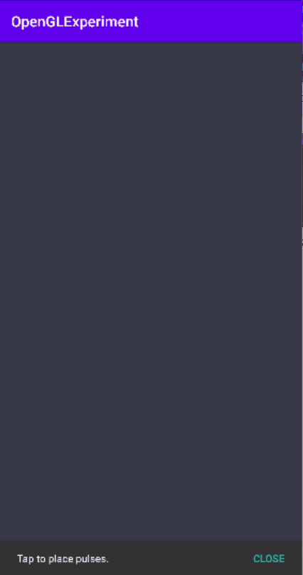
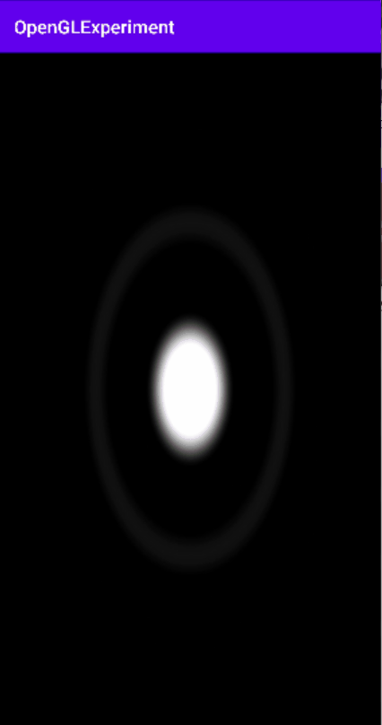
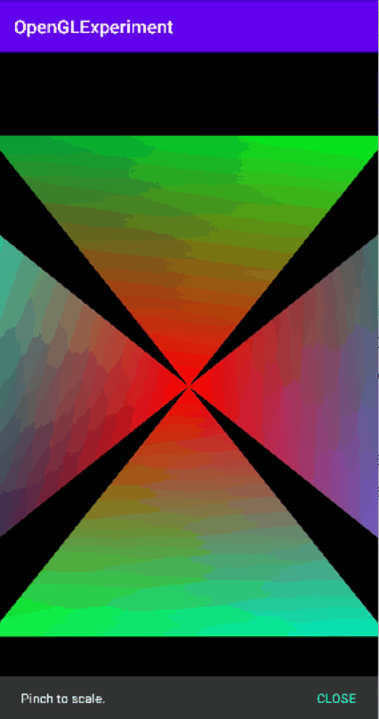
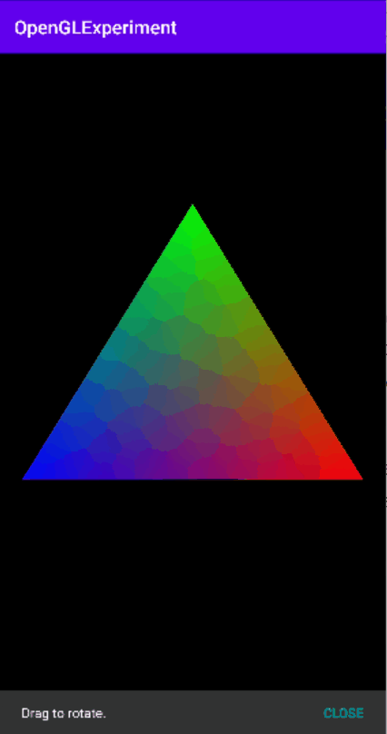
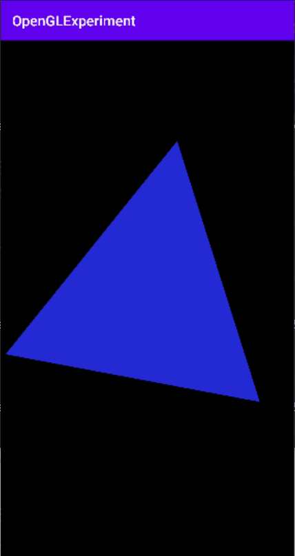

# Android-OpenGL-ES-Experiments
Just a simple repo to experiment various things related to OpenGL ES.

|  |  |  |
| :-: | :-: | :-: |
|  |  |  |
|  |  |  |

__References__ 
- Experiment 6 (Simple pulse) : https://www.shadertoy.com/view/Md3XRB
- Experiment 7 (Smooth pulse) : https://www.shadertoy.com/view/ldtyRn
- Experiment 8 (Silexars Creation) : https://www.shadertoy.com/view/XsXXDn
- Experiment 10 (Rain Drops) : https://www.shadertoy.com/view/ltffzl
- Protean Cloud : https://www.shadertoy.com/view/3l23Rh
